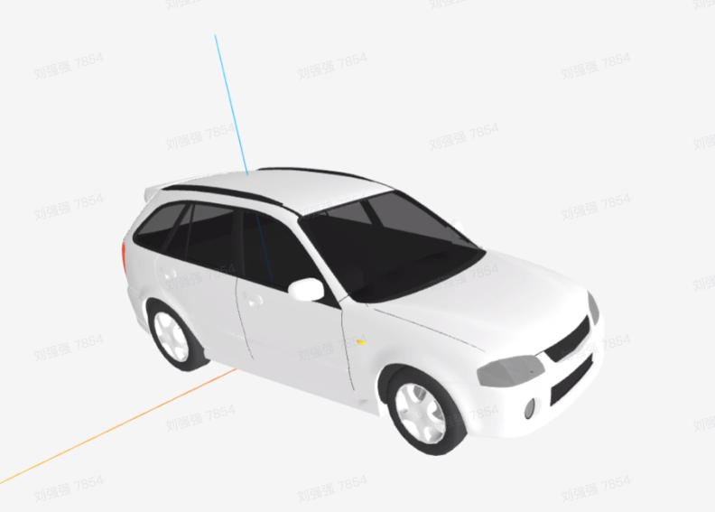

# 默认主题配置

## 首页

## 富文本footer

## 导航栏

### 导航栏 Logo

### 导航栏链接

### 禁用导航栏

## 侧边栏

### 嵌套的标题链接

### 显示所有页面的标题链接

## markdown扩展语法学习

### 链接

[to config](./config.md)

[my github](https://github.com/lehamber)

 

## 自定义容器
::: tip
这是一个提示
:::

::: warning
这是一个警告
:::

::: danger
这是一个危险警告
:::

::: details
这是一个详情块，在 IE / Edge 中不生效
adfasdf
:::

::: tip
这是一个提示
:::

::: warning
这是一个警告
:::

::: danger
这是一个危险警告
:::

::: details
这是一个详情块，在 IE / Edge 中不生效
adfasdf
asdfafs
:::

::: tip
这是一个提示
:::

::: warning
这是一个警告
:::

::: danger
这是一个危险警告
:::

::: details
这是一个详情块，在 IE / Edge 中不生效
adfasdf
asdfafs
:::

## liu

### qiang

### wang

## li

 